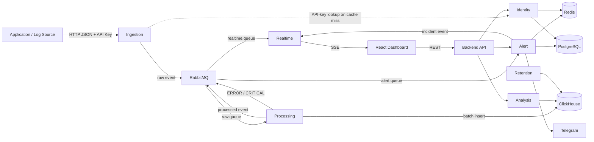

# Architecture

## 1. Overview

The system is a **Modular Monolith** built with Java + Spring Boot for `dev`, `test`, and `staging`.

Product goals and targets are defined in [MVP Scope](../product/mvp-scope.md) and [Non-Functional Requirements](../product/non-functional-requirements.md).

Logical modules:
- Identity
- Ingestion
- Processing 
- Alert
- Realtime  
- Analysis
- Retention

Modules are boundaries inside the same application, not independent microservices. Synchronous module calls use in-process interfaces; RabbitMQ is used for asynchronous log/event flows. Do not introduce localhost HTTP calls between modules.

## 2. High-Level Architecture

Exact RabbitMQ exchanges/queues are defined in `rabbitmq-topology.md`.

## 3. Technology Stack

| Area | Technology |
|---|---|
| Backend / Modules | Java 21+ / Spring Boot |
| REST | Spring Web |
| Security | Spring Security |
| Message Queue | RabbitMQ |
| Relational/config/state DB | PostgreSQL |
| Log/analytics DB | ClickHouse |
| Cache / alert dedup | Redis |
| Frontend | React + TypeScript |
| Realtime | SSE |
| Notification | Telegram Bot API |
| Deployment | Docker Compose |

## 4. Data Ownership

**PostgreSQL**
- users and application access;
- applications and environments;
- API-key metadata;
- alert rules;
- incidents and notification state.

**ClickHouse**
- normalized log records and analytics source data.

**Redis**
- API-key cache;
- alert-rule cache where used;
- alert frequency/dedup/cooldown state.

Redis is not a source of truth for persistent logs or relational state.

## 5. Module Boundaries

| Module | Primary responsibility |
|---|---|
| Identity | human auth, applications/environments, API keys, application authorization |
| Ingestion | validate request/API-key context and publish raw events |
| Processing | normalize, batch-persist, publish processed/critical events |
| Alert | evaluate rules, deduplicate, manage incidents, notify |
| Realtime | authorized SSE delivery |
| Analysis | ClickHouse read/query owner: Log Search and Health Analytics |
| Retention | enforce 7-day ClickHouse log retention |

Detailed module contracts belong in `docs/modules/`.

## 6. Architectural Invariants

1. Ingestion never writes logs directly to ClickHouse/PostgreSQL.
2. Ingestion returns `202` only after RabbitMQ publisher confirmation.
3. Processing uses the batch-flush policy defined in [Processing Module](../modules/03-processing.md).
4. Delivery semantics are at-least-once; `event_id` remains stable across retry/redelivery.
5. ClickHouse is the source of truth for logs.
6. PostgreSQL is the source of truth for relational/configuration/Incident state.
7. API key scope is `Environment -> Application`; `host_ip` is log metadata, not identity.
8. Application authorization is enforced server-side for REST and SSE.
9. SSE is best-effort; historical logs remain available through REST search.
10. AI is future scope and must not enter the ingestion critical path.

## 7. MVP Deployment Boundary

Docker Compose packages the Backend, Frontend, PostgreSQL, ClickHouse, RabbitMQ, and Redis.

The MVP does not include Kafka, Elasticsearch/OpenSearch, Kubernetes, exactly-once delivery, multi-region HA, or AI log analysis.
