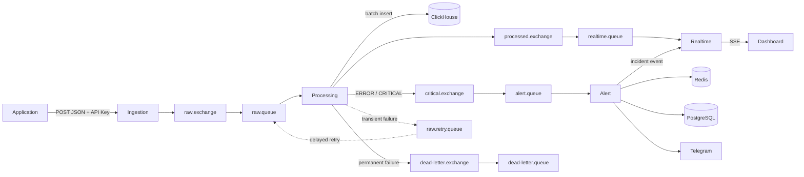
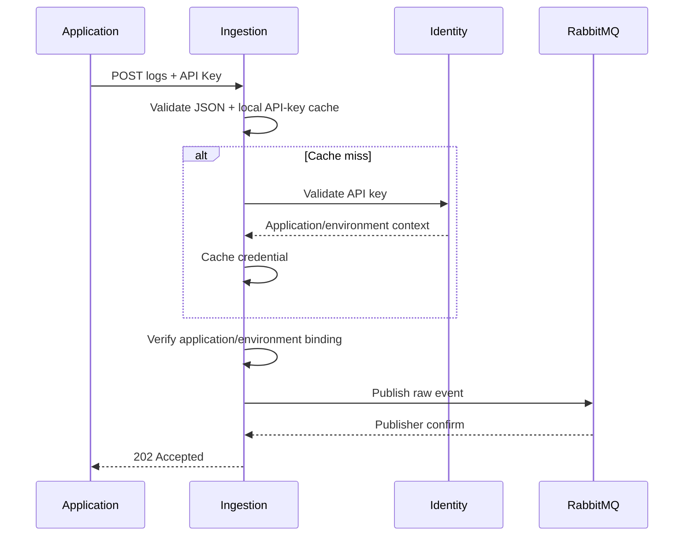
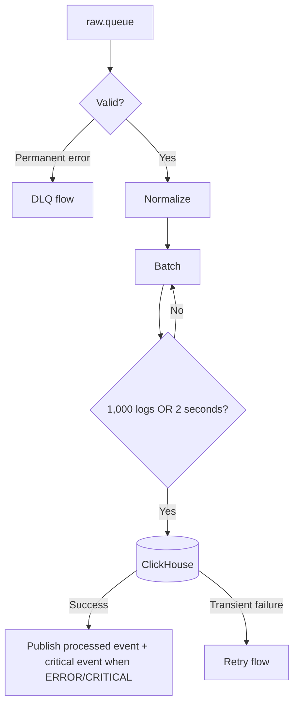
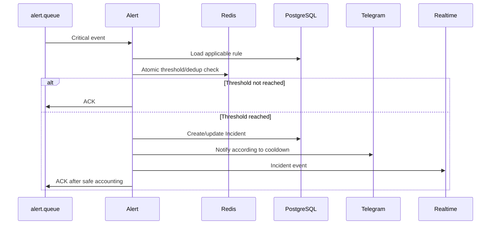
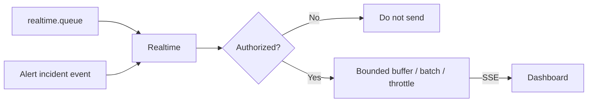
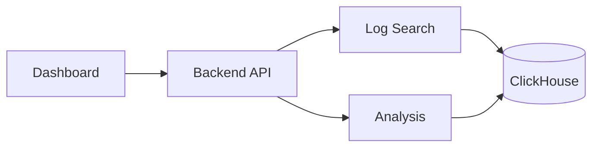
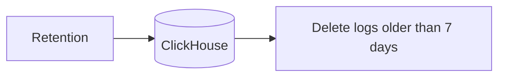

# Data Flow

## 1. End-to-End Log Flow

## 2. Ingestion Flow

The request does not wait for ClickHouse. The raw event carries a stable `event_id`, application/environment identity, original log data, and ingestion metadata.

## 3. Processing Flow

Canonical stored log context includes:
- `event_id`
- `application_id`
- `environment_id`
- `host_ip`
- `level`
- `message`
- `timestamp`
- `trace_id`
- `metadata`
- ingestion/processing timestamps

Permanent data errors go to DLQ and are not application incidents.

## 4. Alert Flow

Matching errors with the same fingerprint update the active Incident. Resolution occurs after the configured `resolve_after` period without matching errors.

## 5. Realtime Flow

Realtime is best-effort. Historical logs are recovered through REST search.

## 6. Search & Analytics

Search filters: application, environment, level, time range, trace_id, and message. Pagination is cursor-based.

MVP analytics:
- total logs;
- ERROR count;
- CRITICAL count;
- Log Error Rate;

grouped by application, environment, and hour.

## 7. Retention

The policy applies to all log levels in dev/test/staging.
