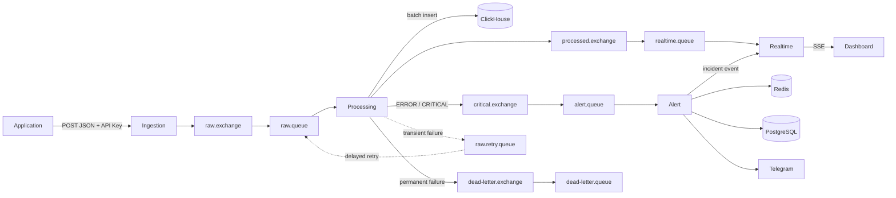
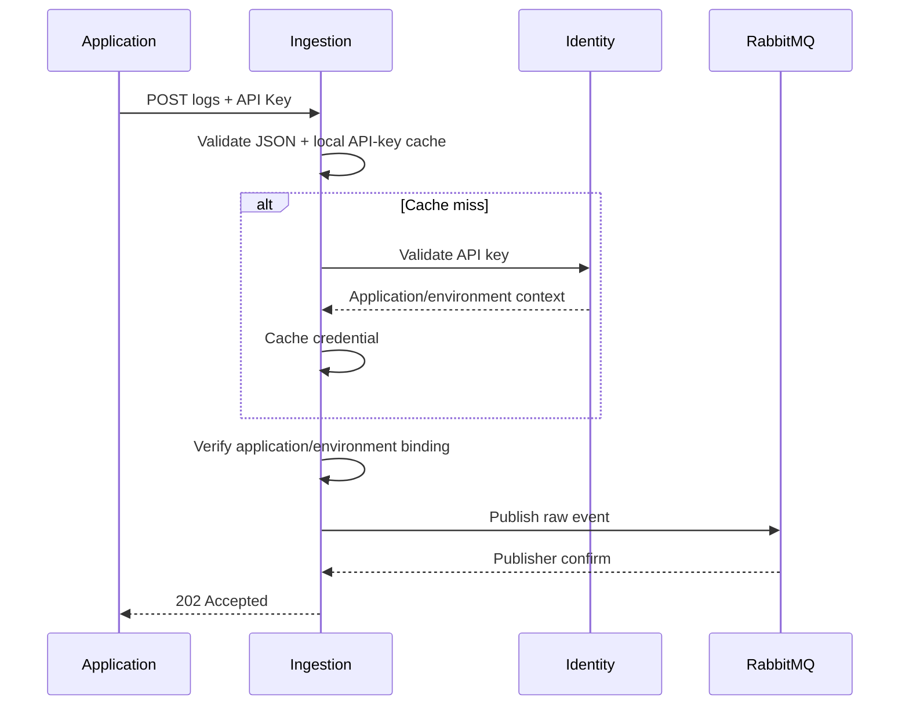
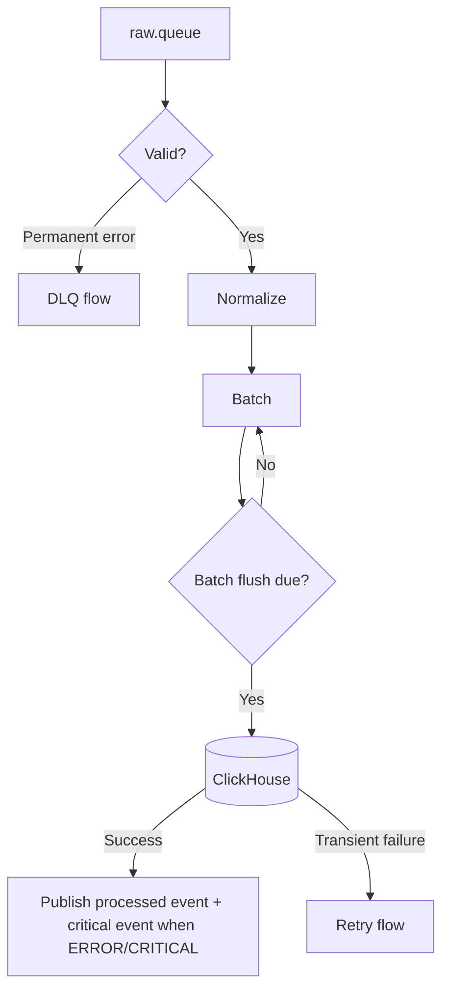
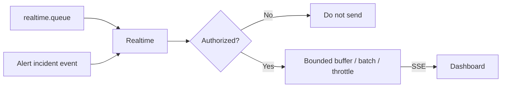
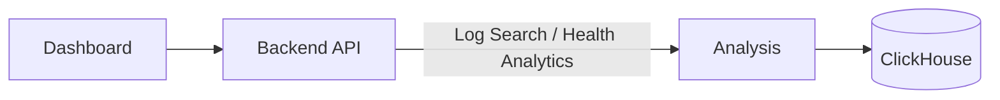
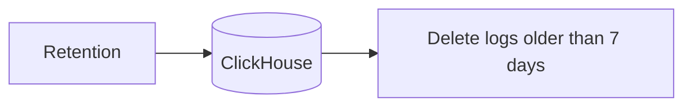

# Data Flow

## 1. End-to-End Log Flow



## 2. Ingestion Flow



The request does not wait for ClickHouse. The raw event carries a stable `event_id`, application/environment identity, original log data, and ingestion metadata.

## 3. Processing Flow



The flush policy is defined in [Processing Module](../modules/03-processing.md). Canonical event and stored-log shapes are defined in [Event Contracts](../contracts/event-contracts.md) and [ClickHouse Schema](../contracts/clickhouse-schema.sql).

Permanent data errors go to DLQ and are not application incidents.

## 4. Alert Flow

```mermaid
sequenceDiagram
    participant Q as alert.queue
    participant A as Alert
    participant R as Redis
    participant P as PostgreSQL
    participant T as Telegram
    participant RT as Realtime

    Q->>A: Critical event (stable event_id)
    A->>P: Check receipt under scope lock
    alt Already committed receipt
        A->>Q: ACK without recounting or changing state
    else Unseen event
        A->>R: Reconcile frequency and evaluate rule
        Note over A,P: Account below-threshold events; update matching OPEN Incident even below threshold
        A->>P: Persist receipt and required Incident/notification state in one transaction
        alt Safe accounting committed
            P-->>A: Commit confirmed
            A->>Q: ACK
            opt Notification work reserved
                A-->>T: Deliver/retry committed notification independently
            end
            opt Incident lifecycle changed
                A-->>RT: Best-effort Incident event
            end
        else Transient failure before safe accounting
            A->>A: Retry same event_id; no ACK before safe accounting or transfer
        end
    end
```

Detailed receipt persistence, redelivery without double-counting, and confirmed retry/DLQ transfer rules are defined in [Alert accounting and redelivery](failure-handling.md#alert-accounting-and-redelivery). Matching errors update the active Incident; resolution follows the configured `resolve_after` period without matching errors.

## 5. Realtime Flow



Realtime is best-effort. Historical logs are recovered through REST search.

## 6. Search & Analytics



Search behavior and analytics metrics are defined in FR04 and FR08 of [Functional Requirements](../product/functional-requirements.md).

## 7. Retention



The policy applies to all log levels in dev/test/staging.
