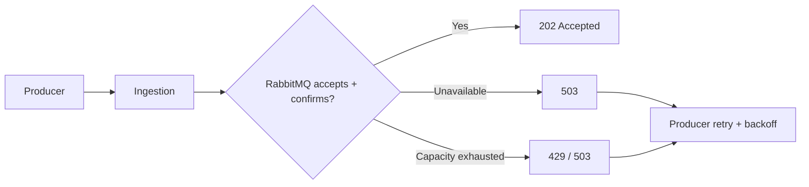
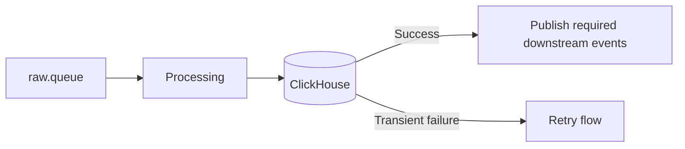
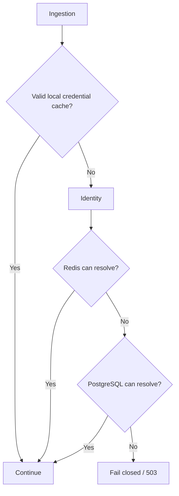

# Failure Handling

## 1. Principles

1. Never silently drop accepted work.
2. Retry transient failures.
3. Route permanently unprocessable messages to DLQ.
4. Apply backpressure when RabbitMQ cannot accept more work.
5. Expect duplicates under at-least-once delivery.
6. Keep Incident state independent from Telegram delivery.
7. Do not bypass alert deduplication when Redis is unavailable.
8. Realtime is best-effort and must not block ingestion/storage.

## 2. Failure Matrix

| Failure | MVP behavior |
|---|---|
| RabbitMQ unavailable | Ingestion returns `503`; producer retries |
| RabbitMQ capacity exhausted | Ingestion returns `429/503`; producer retries with backoff |
| ClickHouse unavailable | Processing retries; message is not marked successfully processed |
| Processing crash before ACK | RabbitMQ redelivers |
| Permanent invalid log | Route to DLQ |
| PostgreSQL unavailable during credential lookup | Fail closed if credential cannot be safely verified |
| PostgreSQL unavailable during alert processing | Retry/keep critical event pending |
| Redis unavailable during alert processing | Retry critical event; do not bypass dedup |
| Telegram unavailable | Keep Incident persisted; retry notification |
| Realtime/SSE unavailable | Storage continues; client reconnects or uses REST search | 

## 3. RabbitMQ Failure / Backpressure

Ingestion must not return `202` without publisher confirmation and must not buffer indefinitely in RAM. Local durable disk spooling is outside MVP.

## 4. ClickHouse / Processing Failure

Temporary ClickHouse unavailability and RabbitMQ communication failures or publish timeouts are transient processing failures.

A failed batch is not treated as successful. Stable `event_id` values are reused on retry/redelivery.

## 5. Invalid Logs

Permanent validation failures such as malformed payloads, missing required fields, unsupported level, invalid timestamp, or unrecoverable schema mismatch are routed to the DLQ.

They are data-quality failures, not application ERROR/CRITICAL incidents.

## 6. At-Least-Once / Idempotency

A worker may fail after a side effect succeeds but before ACK, so RabbitMQ may redeliver the same `event_id`.

Requirements:
- preserve `event_id` across retries;
- tolerate duplicate log processing;
- make Incident state transitions/dedup safe against redelivery;
- notification retry must not recreate the Incident.

### Alert accounting and redelivery

Alert's durable accounting uses `alert_event_receipts` in [PostgreSQL Schema](../contracts/postgres-schema.sql); decisions follow [Alert semantics](../modules/04-alert.md#deterministic-semantics).

1. Serialize evaluation/update/resolution for each `(environment_id, fingerprint)` using a PostgreSQL scope lock, including when no Incident exists. Inside the transaction, check the receipt by `event_id` first. An existing committed receipt is complete accounting: do not change frequency, Incident count, or notification reservations; ACK safely.
2. For an unseen event with an enabled rule, reconcile Redis frequency membership against committed receipts for that rule/scope plus this tentative event before evaluating. Use `event_id` as the unique member and immutable `received_at` as its score. Remove orphan tentative entries from failed attempts and restore missing committed entries after expiry/restart; Redis-only seen flags must never suppress PostgreSQL work. Without an enabled rule, persist a receipt with no rule/Incident association and no frequency contribution.
3. Commit the receipt, required Incident/count/lifecycle changes, window-event associations on opening, and any PENDING notification reservation in one PostgreSQL transaction. The receipt is the fully processed marker; a Redis operation is only tentative until that commit. Retain receipts in MVP independently of 7-day ClickHouse retention so later redelivery cannot be counted again. They contain accounting identifiers/times, not log bodies.
4. If PostgreSQL fails after Redis changes, roll back and retry with the same `event_id`; reconciliation resumes evaluation without counting the tentative member twice. If commit succeeds but the consumer crashes before ACK or Redis completion bookkeeping, redelivery finds the receipt and performs no second durable update. Do not mark successfully processed or ACK before commit; failed attempts may ACK only after the confirmed retry/DLQ transfer in [Topology](rabbitmq-topology.md#5-retry-and-dlq).

Redis remains operational state; PostgreSQL owns durable Incident/accounting state. Redis failure still requires retry, not bypass. Telegram delivery runs from committed notification work and retries that same work independently; a timeout after Telegram accepts a send can produce a duplicate delivery under at-least-once semantics. Realtime remains best-effort and does not gate accounting. No distributed transaction or exactly-once transport guarantee is introduced.

## 7. PostgreSQL / Redis Failure

Credential validation:

For Alert processing:
- PostgreSQL unavailable -> retry/keep event pending because Incident state cannot be safely persisted.
- Redis unavailable -> retry critical event; never send every ERROR/CRITICAL directly to Telegram.

### Human authentication failures

These rules are separate from the API-key cache fallback above:

- Missing, invalid, expired or blacklisted access token, or a missing current user -> controlled `401`.
- Disabled user on protected REST or insufficient permissions -> controlled `403`; disabled login/refresh -> `401`.
- Redis unavailable or blacklist state unverifiable during protected authentication -> fail closed with a safe `500`; never silently bypass or substitute a cache/DB fallback.
- PostgreSQL unavailable while resolving current user/role/status or refresh metadata -> fail closed with a safe `500`.
- Refresh reuse -> `401` and committed refresh-family revocation; concurrent rotation/revocation follows the [Identity lifecycle](../modules/01-identity.md#human-authentication-lifecycle).
- Logout requiring access revocation must write the `jti` blacklist entry through the token's `exp` and commit refresh-session revocation before reporting success. Write the blacklist before committing refresh revocation; if either operation fails, return a safe `500`, retain any completed revocation and never undo it to restore access. PostgreSQL and Redis have no distributed transaction, so partial revocation may occur; failure must not be reported as successful logout.
- Unexpected infrastructure/internal errors use `ApiResponse` with `success: false`, a generic safe message and `data: null`. Never expose internal exception messages, types, stack traces, tokens or secrets. Server-side diagnostics must not log credentials or raw tokens.

## 8. Telegram / Realtime Failure

Telegram failure does not remove or recreate an Incident; notification is retried independently.

SSE failure does not stop ingestion or persistence. Clients reconnect, and historical logs remain available through REST search.

## 9. MVP Non-Goals

No distributed transactions, exactly-once delivery, local durable spool, Kubernetes self-healing, multi-region failover, or cross-region replication in MVP.
