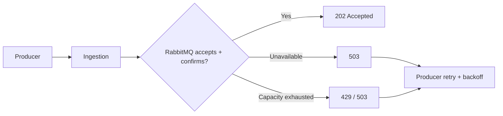
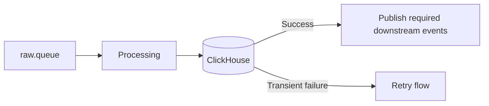
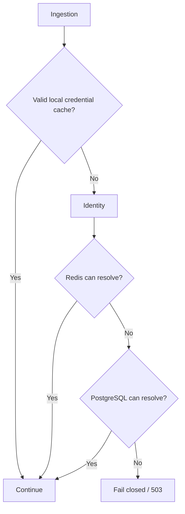

# Failure Handling

## 1. Principles

1. Never silently drop accepted work.
2. Retry transient failures.
3. Route permanently unprocessable messages to DLQ.
4. Apply backpressure when RabbitMQ cannot accept more work.
5. Expect duplicates under at-least-once delivery.
6. Keep Incident state independent from Telegram delivery.
7. Do not bypass alert deduplication when Redis is unavailable.
8. Realtime is best-effort and must not block ingestion/storage.

## 2. Failure Matrix

| Failure | MVP behavior |
|---|---|
| RabbitMQ unavailable | Ingestion returns `503`; producer retries |
| RabbitMQ capacity exhausted | Ingestion returns `429/503`; producer retries with backoff |
| ClickHouse unavailable | Processing retries; message is not marked successfully processed |
| Processing crash before ACK | RabbitMQ redelivers |
| Permanent invalid log | Route to DLQ |
| PostgreSQL unavailable during credential lookup | Fail closed if credential cannot be safely verified |
| PostgreSQL unavailable during alert processing | Retry/keep critical event pending |
| Redis unavailable during alert processing | Retry critical event; do not bypass dedup |
| Telegram unavailable | Keep Incident persisted; retry notification |
| Realtime/SSE unavailable | Storage continues; client reconnects or uses REST search |

## 3. RabbitMQ Failure / Backpressure

Ingestion must not return `202` without publisher confirmation and must not buffer indefinitely in RAM. Local durable disk spooling is outside MVP.

## 4. ClickHouse / Processing Failure

Processing flushes at 1,000 logs or 2 seconds.

A failed batch is not treated as successful. Stable `event_id` values are reused on retry/redelivery.

## 5. Invalid Logs

Permanent validation failures such as missing required fields, unsupported level, invalid timestamp, or unrecoverable schema mismatch are routed to the DLQ.

They are data-quality failures, not application ERROR/CRITICAL incidents.

## 6. At-Least-Once / Idempotency

A worker may fail after a side effect succeeds but before ACK, so RabbitMQ may redeliver the same `event_id`.

Requirements:
- preserve `event_id` across retries;
- tolerate duplicate log processing;
- make Incident state transitions/dedup safe against redelivery;
- notification retry must not recreate the Incident.

## 7. PostgreSQL / Redis Failure

Credential validation:

For Alert processing:
- PostgreSQL unavailable -> retry/keep event pending because Incident state cannot be safely persisted.
- Redis unavailable -> retry critical event; never send every ERROR/CRITICAL directly to Telegram.

## 8. Telegram / Realtime Failure

Telegram failure does not remove or recreate an Incident; notification is retried independently.

SSE failure does not stop ingestion or persistence. Clients reconnect, and historical logs remain available through REST search.

## 9. MVP Non-Goals

No distributed transactions, exactly-once delivery, local durable spool, Kubernetes self-healing, multi-region failover, or cross-region replication in MVP.
