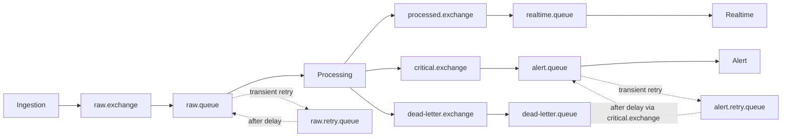
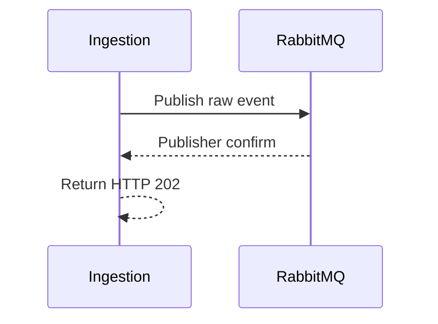
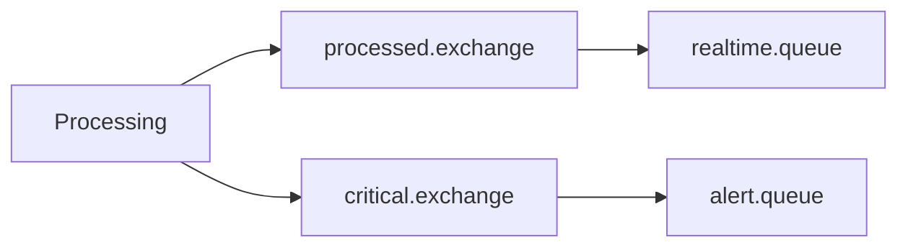

# RabbitMQ Topology

## 1. Topology

RabbitMQ provides ingestion buffering, asynchronous delivery, retry, and dead-letter handling.



## 2. Exchanges and Queues

| Exchange | Queue | Consumer / Purpose |
|---|---|---|
| `raw.exchange` | `raw.queue` | Processing |
| `processed.exchange` | `realtime.queue` | Realtime |
| `critical.exchange` | `alert.queue` | Alert |
| `dead-letter.exchange` | `dead-letter.queue` | permanently failed message inspection |

`raw.retry.queue` provides delayed retry for transient processing failures. `alert.retry.queue` provides the equivalent delayed retry path for `alert.queue`, returning through `critical.exchange` with routing key `critical.log`. Both retry queues are durable and transfers preserve the original envelope/payload and `event_id`.

Suggested routing keys:

```text
raw.log
processed.log
critical.log
dead-letter.log
```

Exact payloads and bindings belong in the event contract/configuration.

## 3. Publisher and ACK Semantics

### Ingestion



Use durable exchanges/queues and persistent messages. Return ingestion success only after publisher confirmation and successful routing to `raw.queue`; unroutable publications fail ingestion. Retry/DLQ transfers require confirmed routing before ACKing the original message.

### Processing

A raw message is ACKed only after its required durable work for that processing attempt is safely accounted for: ClickHouse persistence and required processed/critical publication. Failures enter the retry/DLQ policy instead of being silently ACKed.

### Alert

Successful Alert ACK follows [Failure Handling](failure-handling.md#alert-accounting-and-redelivery), independently of Telegram/SSE delivery. Failed attempts use confirmed retry/DLQ transfer before ACKing their original delivery.

## 4. At-Least-Once

Redelivery and duplicate processing are expected.

Mitigation:
- stable `event_id`;
- idempotent processing where required;
- Redis atomic alert deduplication;
- PostgreSQL Incident fingerprint/state constraints.

## 5. Retry and DLQ

Suggested configurable retry schedule:

```text
5 seconds -> 30 seconds -> 2 minutes
```

Permanent validation failures go directly to DLQ. Transient failures are retried; after the configured retry policy is exhausted, the message must remain explicitly accounted for rather than silently dropped.

For `alert.queue`, transient Redis/PostgreSQL/consumer failures use `alert.retry.queue` with the same suggested delays and the retry bound defined in [Configuration](../operations/configuration.md#6-alerting). Permanently unprocessable critical events go directly to `dead-letter.exchange` / `dead-letter.queue`; exhausted transient attempts go there with reason `ALERT_RETRY_EXHAUSTED`. Preserve the original critical envelope in the DLQ payload's `original_message` for inspection/recovery. Missing/disabled rules are accounted no-ops, not permanent errors. If retry/DLQ routing or confirmation fails, do not ACK the original; retain it for broker redelivery.

The original message is considered handled only after successful retry/DLQ accounting.

## 6. Critical Flow

ERROR/CRITICAL events use a separate exchange/queue:



A RabbitMQ priority queue is not required.

## 7. Backpressure

When RabbitMQ cannot accept more work, Ingestion returns `429` or `503` and the producer retries with backoff. MVP does not use local disk spooling.

## 8. Minimum Observability

Monitor:
- queue depth;
- publish/consume rate;
- retry count;
- DLQ count;
- consumer availability.
