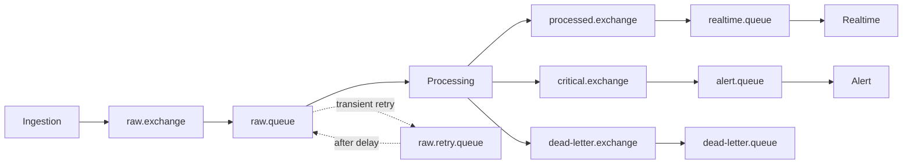
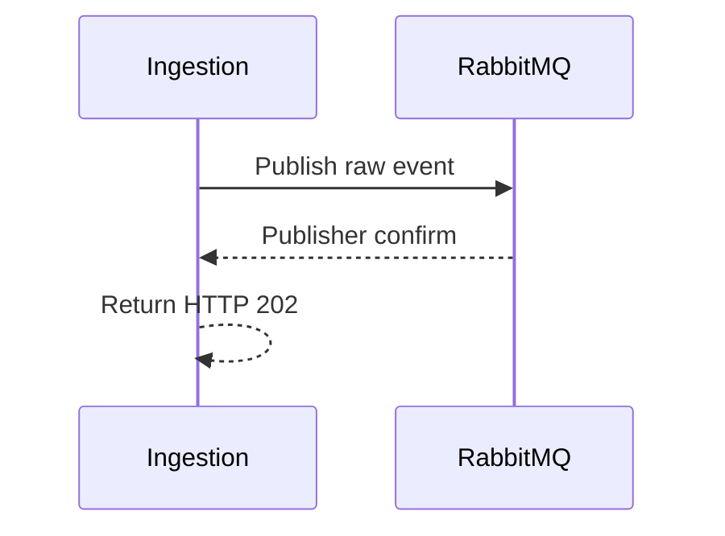
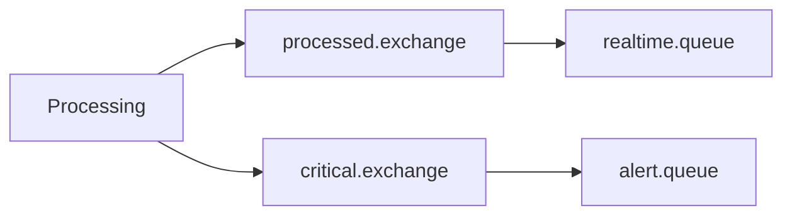

# RabbitMQ Topology

## 1. Topology

RabbitMQ provides ingestion buffering, asynchronous delivery, retry, and dead-letter handling.



## 2. Exchanges and Queues

| Exchange | Queue | Consumer / Purpose |
|---|---|---|
| `raw.exchange` | `raw.queue` | Processing |
| `processed.exchange` | `realtime.queue` | Realtime |
| `critical.exchange` | `alert.queue` | Alert |
| `dead-letter.exchange` | `dead-letter.queue` | permanently failed message inspection |

`raw.retry.queue` provides delayed retry for transient processing failures.

Suggested routing keys:

```text
raw.log
processed.log
critical.log
dead-letter.log
```

Exact payloads and bindings belong in the event contract/configuration.

## 3. Publisher and ACK Semantics

### Ingestion



No publisher confirmation means no successful ingestion response.

### Processing

A raw message is ACKed only after its required durable work for that processing attempt is safely accounted for: ClickHouse persistence and required processed/critical publication. Failures enter the retry/DLQ policy instead of being silently ACKed.

## 4. At-Least-Once

Redelivery and duplicate processing are expected.

Mitigation:
- stable `event_id`;
- idempotent processing where required;
- Redis atomic alert deduplication;
- PostgreSQL Incident fingerprint/state constraints.

## 5. Retry and DLQ

Suggested configurable retry schedule:

```text
5 seconds -> 30 seconds -> 2 minutes
```

Permanent validation failures go directly to DLQ. Transient failures are retried; after the configured retry policy is exhausted, the message must remain explicitly accounted for rather than silently dropped.

The original message is considered handled only after successful retry/DLQ accounting.

## 6. Critical Flow

ERROR/CRITICAL events use a separate exchange/queue:



A RabbitMQ priority queue is not required.

## 7. Backpressure

When RabbitMQ cannot accept more work, Ingestion returns `429` or `503` and the producer retries with backoff. MVP does not use local disk spooling.

## 8. Minimum Observability

Monitor:
- queue depth;
- publish/consume rate;
- retry count;
- DLQ count;
- consumer availability.
