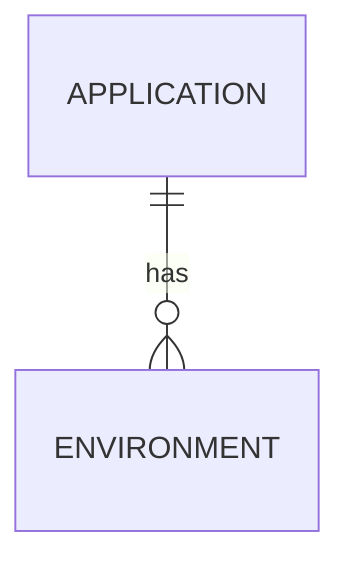
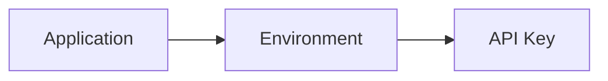
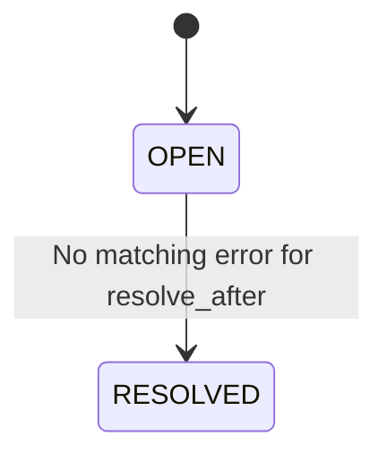

# Functional Requirements

## 1. Scope

The system is designed for pre-production environments:

- `dev`
- `test`
- `staging`

Each log record must be associated with at least:

- `application`
- `environment`
- `host_ip` 

> `host_ip` is metadata describing the source host of a log. It must not be used as the primary mechanism for determining the application/environment or authenticating a log source.

---

## FR01 — Application Management

### Objective

Allow Administrators to manage applications and environments and assign Engineers to applications.

An application may exist in multiple environments.

### Functional Requirements

- Admin can create, view, update, and disable applications.
- Admin can manage environments belonging to an application.
- Admin can assign Engineers to applications.
- Engineers can access only the applications assigned to them.
- Engineers can access all environments belonging to their assigned applications.
- An application may have multiple environments (`dev`, `test`, `staging`).
- The system must distinguish between application and environment in all log-related operations.

### Application Context

Application data shapes are defined in [OpenAPI](../contracts/openapi.yaml) and [PostgreSQL Schema](../contracts/postgres-schema.sql).
 
### Environment Context

An environment belongs to an application and has a controlled type:
 
```text
DEV 
TEST
STAGING
```

Relationship:



### Host Context

Each log record stores `host_ip` to identify the host from which the log originated.

`host_ip` must not be used as the primary authentication or authorization mechanism because IP addresses may change and traffic may pass through proxies or load balancers.

### API Key Scope

Each API key belongs to exactly one environment.



Because an Environment belongs to an Application, an API key determines the following context:

```text
API Key
  -> Environment
  -> Application
```

### Authorization

- `ADMIN`: can manage all applications, environments, credentials, and access assignments.
- `ENGINEER`: can access logs, incidents, and analytics only for assigned applications, including all environments belonging to those applications.

---

## FR02 — Log Ingestion

### Objective

Provide an API capable of receiving structured JSON logs at the throughput target in NFR01 of [Non-Functional Requirements](non-functional-requirements.md).

### Log Payload

The exact single/batch log payloads are defined in [OpenAPI](../contracts/openapi.yaml); usage examples are in [REST API](../contracts/rest-api.md).

### Functional Requirements

- Applications send logs as JSON.
- Support single-log ingestion.
- Support batch-log ingestion.
- The Ingestion API must not write logs directly to ClickHouse or PostgreSQL.
- The Ingestion API must publish raw logs to RabbitMQ.
- The API returns `202 Accepted` only after RabbitMQ confirms that the message has been accepted.
- The ingestion request does not wait for logs to be persisted into ClickHouse.
- If RabbitMQ is unavailable or cannot accept additional messages, the API must return an appropriate error so the producer can retry.
- The system must not silently accept logs that have not been successfully published to RabbitMQ.

### API Key Authentication

The Ingestion API uses an API key assigned to an application environment.

Credential lookup and caching follow [Ingestion Module](../modules/02-ingestion.md); lifecycle and fail-closed rules are defined in [Security Specification](../quality/security.md).

Requirements:

- An API key determines the authorized `application` and `environment`.
- A producer must not submit logs for an application/environment outside the scope of its API key.
- If credential validity cannot be safely determined, authentication must fail closed.

### Validation

The system validates API-key scope and all log fields according to [OpenAPI](../contracts/openapi.yaml).

---

## FR03 — Log Processing & Storage

### Objective

Process raw logs asynchronously from RabbitMQ, normalize them, and persist them into ClickHouse.

The processing flow is defined in [Data Flow](../architecture/data-flow.md), with routing in [RabbitMQ Topology](../architecture/rabbitmq-topology.md).

### Functional Requirements

- Processing consumes raw logs asynchronously.
- Logs must be validated and normalized before persistence.
- Normalized logs are persisted into ClickHouse.
- Processing uses batch inserts according to the flush policy in [Processing Module](../modules/03-processing.md).
- Successfully normalized logs are published to the processed event flow for the Realtime Module.
- `ERROR` and `CRITICAL` logs are additionally published to the critical event flow for the Alert Module.
- The system uses at-least-once delivery semantics.
- Every log event has a stable `event_id`.
- `event_id` must remain unchanged across retries and redeliveries.
- Duplicate delivery must not interrupt processing.
- Transient failures must be retried.
- Permanently invalid messages must be moved to a Dead Letter Queue.
- Logs must never be silently dropped.
- Stored logs must preserve:
  - application
  - environment
  - host_ip

### Failure Classification

Failure classification is defined in [Failure Handling](../architecture/failure-handling.md).

Permanent data errors must not be treated as application incidents.

---

## FR04 — Log Search

### Objective

Allow Engineers and Administrators to search centralized logs stored in ClickHouse.

### Search Filters

The system supports filtering by:

- `application`
- `environment`
- `level`
- `time range`
- `trace_id`
- `message`

Filters may be combined.

### Pagination

The Log Search API must use:

```text
Cursor-based pagination
```

Requirements:

- Offset pagination must not be used for large log datasets.
- The API returns a next cursor when additional results are available.
- Cursor ordering must be deterministic.

### Authorization

- Engineers can search only applications assigned to them.
- Engineers can search all environments belonging to their assigned applications.
- Admin can search all applications and environments.
- Authorization must be enforced by the backend, not by frontend filtering.

---

## FR05 — Real-time Log Viewer

### Objective

Display newly processed logs in real time without requiring the user to reload the page.

The realtime protocol is:

```text
Server-Sent Events (SSE)
```

### Realtime Filters

The UI supports realtime filtering by:

- application
- environment
- level

The realtime flow is defined in [Data Flow](../architecture/data-flow.md).

### Functional Requirements

- SSE connections must be authenticated.
- The client must be able to reconnect after the SSE connection is lost.
- The server must stream only data that the authenticated user is authorized to view.
- Authorization must be enforced server-side.
- Application/environment filters supplied by the client may narrow access but must never expand the user's permissions.
- The Realtime Module must use bounded buffering, batching, or throttling to prevent slow clients from causing unbounded memory usage.
- The UI must limit the number of logs retained/rendered in the browser to prevent performance degradation.
- Realtime delivery is best-effort.
- Realtime availability must not affect log ingestion or persistence.
- Historical logs remain available through the REST Log Search API.

---

## FR06 — Incident Detection & Alerting

### Objective

Detect elevated error activity and group related error logs into Incidents.

### Alert Rule

Alert rules are configured using:

- `application`
- `environment`
- `level`
- `threshold`
- `time_window`
- `cooldown`
- `resolve_after`
- `enabled`

Example:

```text
Application: payment-service
Environment: test
Level: ERROR

Threshold: 10
Time Window: 60 seconds
Cooldown: 300 seconds
Resolve After: 300 seconds
```

Incident detection flow and module behavior are defined in [Data Flow](../architecture/data-flow.md) and [Alert Module](../modules/04-alert.md).

### Incident Requirements

When an alert rule is triggered:

- An Incident is opened or an existing matching Incident is updated.
- Incident state is persisted in PostgreSQL.
- A Telegram notification is generated according to the notification/cooldown policy.
- An Incident event is sent to authorized realtime clients.

### Deduplication

- Errors with the same fingerprint belonging to the same active Incident must not create new Incidents.
- Repeated matching errors update the existing Incident.
- Incident must maintain at least:
  - `error_count`
  - `first_seen_at`
  - `last_seen_at`
  - `status`
  - `application`
  - `environment`
  - fingerprint
- Cooldown prevents excessive repeated notifications.
- Atomic frequency tracking and deduplication follow [Alert Module](../modules/04-alert.md).

### Resolution

When no matching error is observed for the configured `resolve_after` duration:



The Incident transitions from:

```text
OPEN -> RESOLVED
```

---

## FR07 — Authorization

### Objective

Restrict access by application so multiple teams/projects can safely use the same monitoring system.

### Roles

#### ADMIN

Admin can:

- manage applications;
- manage environments;
- assign Engineers to applications;
- manage API keys;
- view all logs;
- view all Incidents;
- view all analytics;
- configure Alert Rules.

#### ENGINEER

Engineer can:

- view logs for assigned applications;
- view Incidents for assigned applications;
- view analytics for assigned applications;
- access all environments belonging to assigned applications.

### Authorization Boundary

Authorization must be enforced by the backend for:

- REST APIs
- SSE streams
- Log Search
- Incidents
- Analytics

Frontend filtering must never be considered an authorization mechanism.

---

## FR08 — Retention & Analytics

### Log Retention

Logs stored in ClickHouse follow this retention policy:

```text
Log age > 7 days -> Delete
```

Requirements:

- Applies to all log levels.
- Applies to `dev`, `test`, and `staging`.
- Does not distinguish between:
  - `INFO`
  - `WARN`
  - `ERROR`
  - `CRITICAL`
- Cleanup runs asynchronously using a background process or ClickHouse-native TTL mechanism.
- Cleanup must not be part of the ingestion critical path.
- Cleanup must not significantly interfere with normal ingestion/search.
- PostgreSQL configuration and Incident data must not be deleted by the log-retention policy.

### Application Health Analytics

The Dashboard supports statistics grouped by:

- application
- environment
- hour

MVP metrics include:

- total logs
- ERROR count
- CRITICAL count
- Log Error Rate

`Log Error Rate` is defined as:

```text
Log Error Rate =
    (ERROR count + CRITICAL count)
    --------------------------------
              total logs
```

> Log Error Rate represents the percentage of error-level log records among all log records. It is not the HTTP/request error rate of the monitored application.
