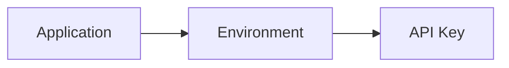

# Security Specification

## 1. Authentication

### Human users
- `ADMIN` and `ENGINEER` authenticate through the Backend API.
- Protected REST endpoints require a valid authenticated user.
- Passwords must be stored using a strong one-way password hash.
- Authentication secrets/tokens must never be logged.

### Log sources
Applications authenticate to the Ingestion API using an API key.

Each API key belongs to exactly one environment, and therefore indirectly to exactly one application:

The API key is not derived from `host_ip`. `host_ip` is log/source metadata, not the primary authentication mechanism.

## 2. Authorization 

### Admin
Admin may:
- manage applications and environments;
- manage engineers and application assignments;
- create/revoke/rotate API keys;
- manage alert rules;
- view logs/incidents/analytics for all applications.

### Engineer
Engineer may:
- view logs, realtime streams, incidents and analytics only for assigned applications;
- access all environments belonging to an assigned application.

Authorization must be enforced on the server for REST and SSE. Never rely on frontend filtering.

### Disabled state

- A DISABLED user cannot log in (`401`). Protected REST requests re-evaluate user status and deny a disabled user (`403`). SSE establishment/re-establishment and existing per-event authorization checks include user status; stop delivery/close the connection when that check finds the user disabled. No token-revocation broadcast infrastructure is required.
- A DISABLED application blocks new ingestion in all its environments. A DISABLED environment blocks ingestion for its scoped keys, even when the key itself is ACTIVE (`401`). Status changes invalidate cached credential context or take effect within the same bounded cache TTL used for revocation; cached context includes application/environment status and key expiry.
- Disabled applications/environments retain historical logs, Incidents, and analytics access for otherwise authorized ACTIVE users. They remain visible in authorized metadata listings and do not remove historical read scope from SSE; previously accepted work may finish processing.
- Management requiring an active scope is denied (`403`): creating environments under a disabled application, creating/rotating keys or creating/enabling rules in a disabled application/environment, and assigning Engineers to a disabled application. For disabled records, allow reads, revocation, access removal, rule disabling, and explicit status reactivation; other application/environment updates are denied. An environment can be reactivated only under an ACTIVE application.

## 3. API Key Validation

Credential lookup and caching follow [Ingestion Module](../modules/02-ingestion.md) and [Identity Module](../modules/01-identity.md). Dependency failures follow [Failure Handling](../architecture/failure-handling.md).

Rules:
- Store only a secure hash/fingerprint of the secret in PostgreSQL.
- Redis/local cache must not become the source of truth.
- Revocation/rotation must invalidate cached credentials or ensure they expire within the configured cache TTL.
- Expired/revoked credentials are rejected.
- If validity cannot be safely determined, fail closed.

## 4. API Key Lifecycle

Supported operations:
- create;
- revoke;
- rotate.

The plaintext API key is returned only when it is created/rotated and must not be recoverable later from storage.

## 5. Sensitive Data

Never log:
- passwords;
- JWT/session secrets;
- plaintext API keys;
- Telegram bot token; 
- database credentials.

Secrets are supplied through environment variables or Docker secrets/configuration, never committed to source control. Initial Admin credentials follow [Configuration](../operations/configuration.md#initial-admin-bootstrap); never log the bootstrap password or store it in plaintext.

## 6. SSE Security

Every SSE connection must be authenticated.

Before sending an event, Realtime must enforce application authorization. Client-provided application/environment filters may narrow access but must never expand it.

## 7. Minimum Security Rules

- Validate all request payloads.
- Use parameterized database access.
- Restrict CORS to configured frontend origins.
- Apply reasonable ingestion payload/batch-size limits.
- Do not expose stack traces or secrets in API responses.
- Use the common API error envelope.
