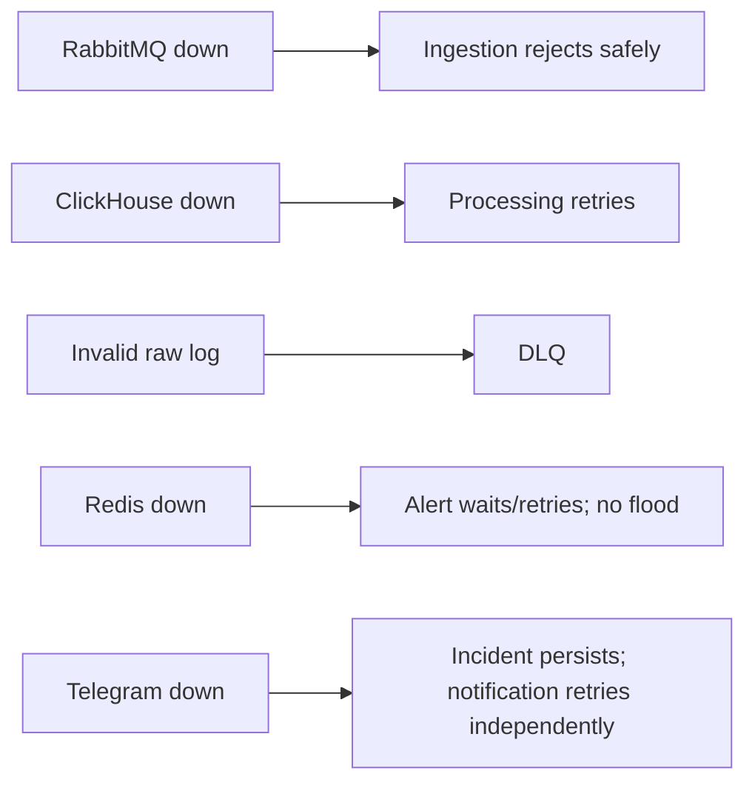

# Testing Strategy

Keep the test suite focused on architectural and business risks.

## 1. Unit Tests

Required for logic that does not need infrastructure:

- API-key/application/environment validation;
- log normalization/validation;
- alert threshold evaluation;
- fingerprint/dedup decisions and boundary/count/cooldown cases in [Alert semantics](../modules/04-alert.md#deterministic-semantics);
- authorization rules;
- cursor encode/decode;
- Incident state transitions.

## 2. Integration Tests

Use real disposable dependencies where practical (for example Testcontainers) for:

- PostgreSQL repositories/migrations and configured-username Admin bootstrap: creation with BCrypt password persistence, repeated startup and existing ADMIN preservation (including DISABLED), ENGINEER username rejection, disabled bootstrap, and safe invalid-configuration failures;
- ClickHouse insert/search, hourly health analytics, and 7-day TTL without deleting PostgreSQL state;
- Redis cache/dedup atomic behavior, including API-key invalidation/expiry and bounded local caching;
- RabbitMQ publish/consume/ACK/retry/DLQ, including unroutable publishes and stable event IDs under redelivery without duplicate Incident/notification storms;
- module integration across the main ingestion flow.

Do not mock infrastructure behavior that the test specifically intends to verify.

## 3. API Tests

Verify:
- common response envelope;
- authentication/authorization;
- ingestion status codes;
- search filters + cursor pagination;
- application/environment management and access boundaries, including [DISABLED semantics](security.md#disabled-state), bounded cache invalidation, denied login/protected access/SSE, and authorized historical reads;
- application-name and login-username length boundaries (100 passes length validation, 101 rejected with `400` before persistence);
- API-key create/revoke/rotate, one-time secret responses, and rejection after invalidation/cache expiry;
- alert-rule and Incident APIs.

## 4. Failure Tests

At minimum verify:

Alert recovery tests must cover PostgreSQL rollback after Redis mutation; commit followed by crash before ACK; concurrent duplicate events and threshold crossings; Redis state loss followed by receipt-based reconciliation; and delayed redelivery after the frequency window expires. Assert receipt/count/Incident/notification reservation outcomes from [Failure Handling](../architecture/failure-handling.md#alert-accounting-and-redelivery), including below-threshold accounting. Verify alert retry exhaustion/permanent errors reach DLQ with stable identity and failed retry/DLQ confirmation leaves the original unacknowledged. Telegram configuration tests cover the single required destination when enabled and continued Incident processing when disabled.

## 5. Realtime Tests 

Verify:
- authenticated SSE connection;
- authorized application filtering;
- environment/level filtering and Incident lifecycle events;
- disconnect/reconnect behavior;
- bounded handling of slow clients and browser rendering;
- no dependency from log durability to SSE delivery.

## 6. Load / Demo Test

Run the mandatory demo defined in AC15 of [Acceptance Criteria](acceptance-criteria.md). Correlate generator counts with HTTP acceptance, RabbitMQ delivery/queue drain, ClickHouse search results, Live View, and the alert path to check for silent loss.

Also run a sustained test toward the NFR01 design target in [Non-Functional Requirements](../product/non-functional-requirements.md).

This is a capacity/design validation, not a claim that every developer laptop must sustain that rate.

Benchmark single-log and batch requests; measure ingestion p95, eligible alert latency, and search p95 against NFR02–04 under their stated healthy conditions.

## 7. Definition of Done

A feature is done when:
- implementation matches its module/API contract;
- relevant tests pass;
- no architecture invariant is violated;
- errors use the common API response format;
- new configuration is documented and contains no secrets.
