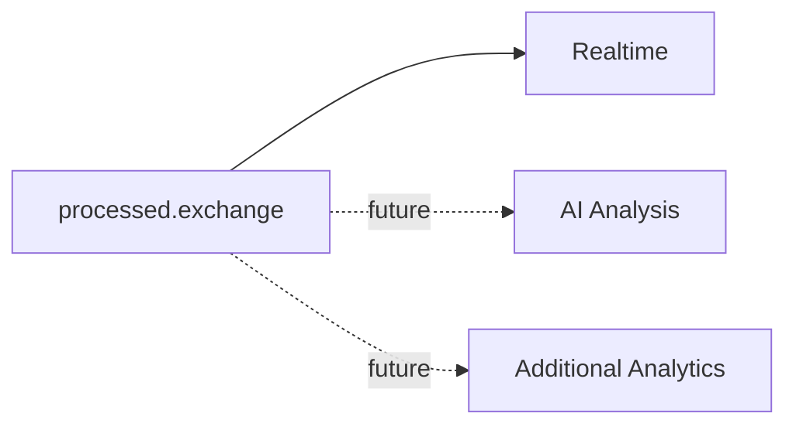

# MVP Scope

## 1. Goal

Build a lightweight centralized log monitoring and alerting system for **dev/test/staging** environments, focused on:

1. collecting JSON logs from multiple applications/services;
2. searching centralized logs;
3. viewing logs in realtime;
4. detecting ERROR/CRITICAL incidents;
5. notifying engineers without alert flooding.

The MVP is designed around a target of **1,000 logs/second** and accepts **at-least-once** delivery semantics.

## 2. In Scope

### Application & Access Management
- Admin manages applications and environments.
- Admin assigns Engineers to applications.
- Engineer access is application-scoped and includes all environments of the assigned application.
- API keys are created/revoked/rotated and scoped to one environment.

### Log Ingestion
- HTTP POST single/batch JSON ingestion.
- API-key authentication.
- `application`, `environment`, `host_ip`, `level`, `message`, `timestamp`, `trace_id` and optional metadata.
- Local RAM API-key cache with Identity/Redis fallback.
- RabbitMQ buffering.
- Publisher confirms.
- At-least-once delivery.

### Log Processing & Storage
- Validate and normalize raw logs.
- Batch insert into ClickHouse at 1,000 logs or 2 seconds.
- ERROR/CRITICAL events are copied to the alert path.
- Permanent invalid records go to DLQ.
- Transient failures retry.

### Search
Filters:
- application;
- environment;
- level;
- time range;
- trace_id;
- message.

Cursor pagination is required.

### Realtime
- SSE Live View.
- Application/environment filtering.
- Server-side authorization.
- Incident realtime events.

### Alerting
- Rules configured by application/environment/level.
- Threshold + time window + cooldown.
- Redis deduplication/rate state.
- Incident-oriented alerting.
- Telegram notification.
- Incident persistence in PostgreSQL.

### Retention
- All ClickHouse logs older than 7 days are removed.
- No level-specific retention in MVP.

### Analytics
Basic Application Health Analytics:
- total logs;
- ERROR/CRITICAL counts;
- error rate;

### Packaging & Demo
- Dockerfile(s).
- Docker Compose for Backend, Frontend, PostgreSQL, ClickHouse, RabbitMQ and Redis.
- Demo log generator.
- Demonstrate 500 logs within 2 seconds and realtime display.

## 3. Out of Scope

Not part of MVP:

- AI log analysis/classification;
- Elasticsearch/OpenSearch;
- Kafka;
- Kubernetes;
- production/multi-region HA design;
- exactly-once delivery;
- local durable disk spool at Ingestion;
- full APM/tracing platform;
- infrastructure/host monitoring;  
- automatic root-cause analysis;
- advanced reporting/BI;
- complex multi-tenant SaaS billing/organization model.

## 4. Future Extension Points

Architecture should allow future consumers to subscribe to normalized events, for example:

Future features must not be placed in the ingestion critical path unless the architecture is explicitly revised.

## 5. MVP Completion

MVP is complete when the requirements in  `acceptance-criteria.md` pass and the required 500-logs/2-seconds demo works end-to-end.
