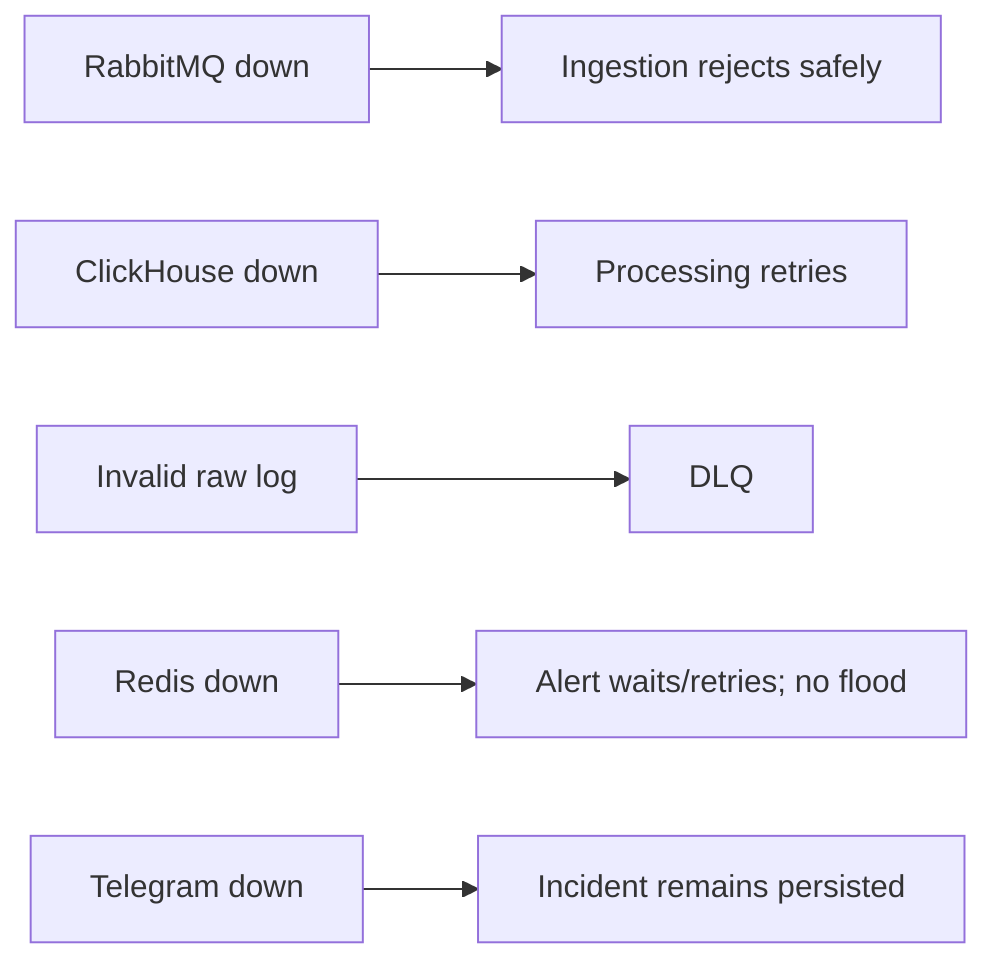

# Testing Strategy

Keep the test suite focused on architectural and business risks.

## 1. Unit Tests

Required for logic that does not need infrastructure:

- API-key/application/environment validation;
- log normalization/validation;
- alert threshold evaluation;
- fingerprint/dedup decisions;
- authorization rules;
- cursor encode/decode;
- Incident state transitions.

## 2. Integration Tests

Use real disposable dependencies where practical (for example Testcontainers) for:

- PostgreSQL repositories/migrations;
- ClickHouse insert/search;
- Redis cache/dedup atomic behavior;
- RabbitMQ publish/consume/ACK/retry/DLQ;
- module integration across the main ingestion flow.

Do not mock infrastructure behavior that the test specifically intends to verify.

## 3. API Tests

Verify:
- common response envelope;
- authentication/authorization;
- ingestion status codes;
- search filters + cursor pagination;
- application/environment access boundaries;
- alert-rule and Incident APIs.

## 4. Failure Tests

At minimum verify:



## 5. Realtime Tests 

Verify:
- authenticated SSE connection;
- authorized application filtering;
- environment filtering;
- disconnect/reconnect behavior;
- bounded handling of slow clients;
- no dependency from log durability to SSE delivery.

## 6. Load / Demo Test

Required MVP scenario:

```text
500 logs / 2 seconds
```

Verify:
- HTTP ingestion succeeds for valid requests;
- RabbitMQ receives the events;
- Processing drains the queue;
- expected logs become searchable in ClickHouse;
- dashboard Live View remains usable.

Also run a sustained test toward the design target:

```text
1,000 logs / second
```

This is a capacity/design validation, not a claim that every developer laptop must sustain that rate.

## 7. Definition of Done

A feature is done when:
- implementation matches its module/API contract;
- relevant tests pass;
- no architecture invariant is violated;
- errors use the common API response format;
- new configuration is documented and contains no secrets.
